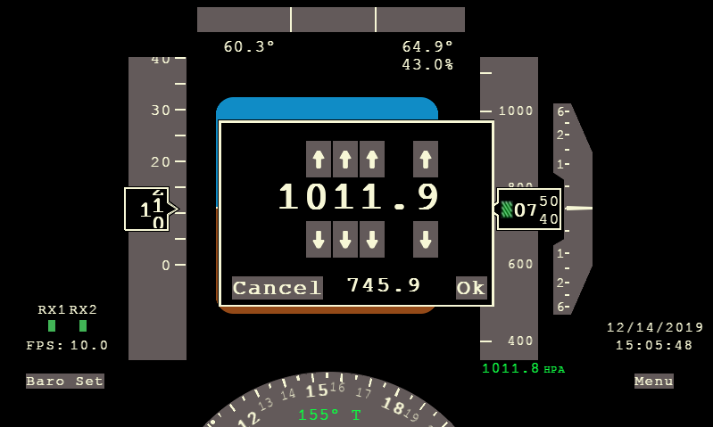

# Primary Flight Display

I thought it would be fun to make a partial replica of a 737-800NG primary flight display for my Jeep.  I re-created the features that are most recognizable, and that would be most useful in a vehicle.  Not everything works yet, and the components aren't finished, but the main components except for the artifical horizon work.  I also added some features that aren't normally on a PFD, such as inside and outiside air temperature and humidity.

It runs on the Raspberry Pi platform.  Here's what I'm using:
* [Raspberry Pi 3 Model B+][9]
* [The official 7″ touchscreen display for Raspberry Pi][10]
* [Enclosure][11]


You can get the simulator up and running in Ubuntu, and see it in action by replaying canned data.  In order to use it in a vehicle, you'll need to make one or both of the [sensor packs](https://github.com/fermitron2048/pfd/tree/master/sensors).  The Main Sensors include a [GPS receiver][1] for location and orientation, a [BNO055][2] accelerometer/gyroscope for yaw, pitch, and roll angles, a [BME280][3] sensor for pressure/temperature/humidity, and a [TSL2561][4] light sensor for dimming the display.  I'm using an [ESP32][5] microcontroller, which supports the GPS receiver and WiFi for streaming parameters to the Raspberry Pi at 10Hz.  The OAT Baro sensor pack include two [BMP388][6] low noise pressure sensors, and a [DS18B20][7] weatherproof temperature sensor for outside air temperature.  It uses the [ESP8266][8] microcontroller, which is lower cost and speed.  The BMP388's can be used as precision altimiters, and the code averages the outputs together for increased accuracy.

Here is what it looks like assembled and in context:


## Installation

Dependencies include [pygame][12] and [numpy][13] for graphics and data processing.  When running on the RPi, [ft5406][14] is needed for touch event handling.

Install main dependencies:
```
$ sudo apt install pygame
```

```
$ sudo apt install numpy
```

Install ft5406:
```
$ git clone https://github.com/pimoroni/python-multitouch.git
...
$ cd library
$ sudo python3 setup.py install
```

To run the display:
```
$ python3 pfd.py
```

And then to feed the pre-canned sensor data into the simulator:
```
$ python3 data/csv2net.py data/sensordata.bin.csv
```

If you run it on a Raspberry Pi, you'll need to setup the RPi as a wireless access point, and configure the sensor packs to connect to it for streaming data.  

## Altimeter setting

Each time a pilot flies a real airplane, they need to adjust the altimeter so that it displays the correct altitude for the current atmospheric pressure, and the same is needed with the altimeter in this PFD.  To adjust the altimeter:

* Touch or click the "Baro Set" button on the display
  * The current sea level pressure is displayed in Hectopascals
* Use the arrows to adjust each number
  * Either adjust the values to match the sea level pressure (in hPa) of the nearest airport, or
  * Adjust the values until the smaller altitude value matches the elevation of your current location



There are currently two alternate mechanisms for altimeter correction.  You can create calibration waypoints that will automatically adjust the altimeter to match your current elevation when you traverse the waypoint.  To do this, you can add your own waypoints to (jeepconfig.json)[jeepconfig.json].  Here is an example:

```
{
	"calibrationpoints": 
	[
		{
			"latitude": 47.614134,
			"longitude": -122.193598,
			"variance": 0.000125,
			"elevation": 147
		},
...
```

You just specify the coordinates of the waypoint in decimal degrees, then specify how far away from the waypoint you need to be to trigger it, and finally specify what the elevation is at that waypoint.  For example, if you want to trigger a calibration when you traverse 47.6140, -122.1930, and you specify a variance of 0.0001, it will trigger if you are within the bounding box:
* 47.6139, -122.1929
* 47.6141, -122.1931

The other mechanism for altimeter correction is automatic elevation state saving.  As you drive around, the code regularly writes the current elevation to a file.  When the RPi is shut off, the file contains the last known elevation (presumably the place you parked).  When you turn on the RPi again, it reads the file and calculates the current sea level pressure based on the pressure at the current elevation.  This happens automatically at startup, so make sure to wait to move the vehicle until it has loaded the state file.  

## Heading calibration

Since the accelerometer data is oriented as 0 degrees forward instead of 0 degrees north, the code has to find the offset to true north.  It does this by continuously monitoring the GPS bearing parameter, and when it has changed little for the last several seconds, it averages the GPS bearing and accelerometer bearing, and calculates the average difference between the two.  From that point on, the display will show the accelerometer bearing plus the difference (offset).  As you drive around, the offset will update again when you are driving straight.

The bearing offset is also stored in the same state file that contains the last known elevation, and it is restored on power up.  That's another reason to keep the vehicle stopped until the PFD is up and receiving data.  Since the heading indicator and altimeter use the accelerometer and pressure sensors, they provide data even when the GPS signal is lost.


[1]: https://www.adafruit.com/product/3133 "Ultimate GPS FeatherWing"
[2]: https://www.adafruit.com/product/2472 "BNO055"
[3]: https://www.adafruit.com/product/2652 "BME280"
[4]: https://www.adafruit.com/product/439 "TSL2561"
[5]: https://www.adafruit.com/product/3405 "ESP32 Feather"
[6]: https://www.adafruit.com/product/3966 "BMP388"
[7]: https://www.adafruit.com/product/381 "DS18B20"
[8]: https://www.adafruit.com/product/2471 "ESP8266"
[9]: https://www.raspberrypi.org/products/raspberry-pi-3-model-b-plus/ "RPi"
[10]: https://www.raspberrypi.org/products/raspberry-pi-touch-display/ "RPi Display"
[11]: https://smarticase.com/products/smartipi-touch "RPi Enclosure"
[12]: https://www.pygame.org "pygame"
[13]: https://numpy.org/ "numpy"
[14]: https://github.com/pimoroni/python-multitouch "ft5406"
