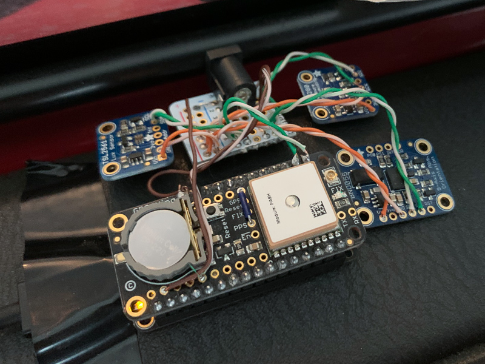
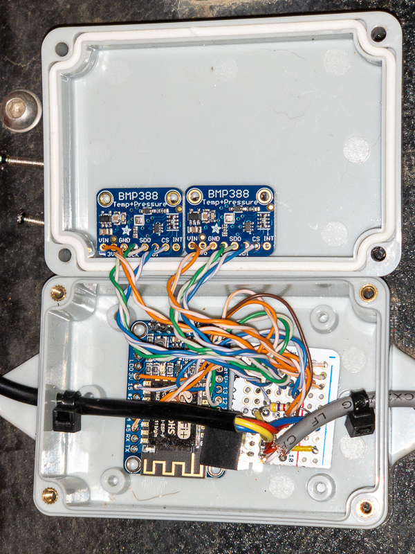
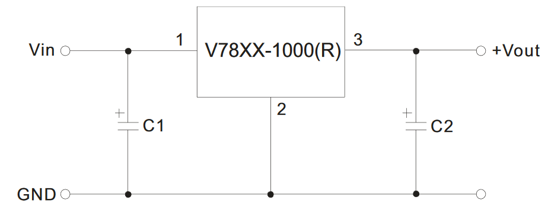

# Sensor Packs

The sensor packs stream parameters to the RPi at 10Hz, after connecting to the SSID of the RPi.  They use ESP microcontrollers from Espressif, and Arduino for code.  

## Main Sensors

The Main Sensors provide the minimum parameters needed to run the PFD.  However, the code currently uses the barometric pressure sensors from the OAT Baro sensor pack, so if you don't make one of those, you'll need to update the code to use the barometric pressure sensor on the Main Sensors for that.  The BME280 pressure sensor has higher noise than the BMP388, so I stopped using it.  Anyway, here is a photo of my Main Sensors:

Here are the components I used for the main sensors:
* [Ultimate GPS Featherwing][1]
* [BNO055][2] accelerometer/gyroscope
* [BME280][3] pressure/temperature/humidity sensors
* [TSL2561][4] light sensor
* [ESP32][5] microcontroller
* [Perma-Proto board][9]
* [2.1mm DC Barrel connector][11]

I used a section of perma-proto board to wire everything together.  It is actually pretty straightfoward, since all of the daughter boards can be powered by 3.3v, and the microcontrollers are 3.3v and have a 3.3v regulator, it is just a matter of connecting all of the power and ground pins together.  Also, all of the daughter boards use I2C, so they can all use the same bus.  Here are the steps:
* Solder female headers onto the ESP32
* Solder male headers onto the Ultimate GPS Featherwing
* Solder a wire from the 3.3v regulator output on the ESP32 to the positive rail on the perma-proto board
* Solder a wire from the ground on the ESP32 to the ground rail on the perma-proto board
* Solder wires from the I2C SDA and SCL pins on the ESP32 (pins 23 and 22) to the perma-proto board
* Solder wires for the 3.3v, gnd, SDA, and SCL pins on the perma-proto board to the corresponding pins of each daughter board
* Solder the 2.1mm barrel connector to the perma-proto board, connect it to ground
* Solder a wire from the positive voltage terminal of the 2.1mm jack to the 5v pin on the ESP32

Notes:
* The perma-proto board has a [2.1mm DC barrel connector][11] that needs to be connected to a 5v power supply.  I used the [BW® RC Servo BEC UBEC 3A 5V for Helicopter Airplane Receiver Servo Power Supply][10] to convert the 12v power from my Jeep to 5v.
* In the photo, I'm powering the ESP32 via USB temporarily, but it will use the 2.1mm jack during permanent installation

When the hardware is ready, use the Arduino IDE to load the software onto the ESP32.  
* You'll need to update the 

## OAT Baro Sensors

This sensor pack has the high precision pressure sensors and outside air temperature sensor.  This one is a bit more complicated from the standpoint that we are using SPI and Dallas One Wire buses, but it's still relatively easy to assemble. Don't be deterred by the surface mount capacitors -- they're easier than you think to solder.  The black cable goes to the temperature sensor, and the gray cable goes to the 12v power in the vehicle.

Here are the components I used for the OAT Baro sensor pack:
* Two [BMP388][6] low noise pressure sensors
* [DS18B20][7] weatherproof temperature sensor (comes with 4.7k resistor)
* [ESP8266][8] microcontroller
* [Perma-Proto board][9]
* [V7805-1000][13] non-linear 5v switching regulator
* [10μF/50V][14] surface mount capacitor (C1 below)
* [22μF/16V][15] surface mount capacitor (C2 below)
* [IP65 Enclosure][12] 3.27"x2.28"x1.3"

Since the BMP388's use SPI, they each need their own separate CS pin.  Here are the pin assignments I used:
* SCK 14 (green)
* MISO 12 (white/green)
* MOSI 13 (blue)
* CS 15 (Goes to one BMP388)
* CS 4 (Goes to the other BMP388)

In most cases, 3.3v is orange, and gnd is white/orange.  The exception is when I wired up pins 4 and 5; I ran out of the right colored wire.  I used [Scotch extreme 1" mounting tape][17] to fasten the circuit boards to the enclosure.  The holes for the cables are slightly larger than the cables, and they aren't sealed, so that the air pressure inside the enclosure matches the outside air pressure.

Here are the steps to assemble:
* Solder the V7805-1000 to 3 separate rows on the perma-proto
* Solder the 10uF capacitor between 12v and gnd (use an alligator clip to hold in place)
* Solder the 22uF capacitor between 5v and gnd
* Solder the red 12v wire of the gray cable to a row connected to pin 1 of the 5v regulator
* Solder the white gnd wire of the gray cable to a row connected to pin 2 of the 5v regulator
* Solder the 5v row of the perma-proto to the Bat pin on the ESP
* Solder the 3V pin on the ESP to the positive rail on the perma-proto
* Solder the red wire of the black cable (DS18B20) to the 3.3v rail
* Solder the blue wire of the black cable to ground
* Solder the yellow wire of the black cable to a row of perma-proto
* Solder one end of the 4.7k resistor to that same row of perma-proto, and solder the other end of the resistor to the 3.3v rail
* Solder a wire to that same row, and solder the other end of it to pin 5 of the microcontroller
* Solder a wire from the positive (3.3v) rail of the perma-proto to the VIN pins on the BMP388's
* Solder a wire from the negative (gnd) rail of the perma-proto to the GND pins on the BMP388's
* Solder the SDO pins on the BMP388's to a row on the perma-proto, then solder that row to pin 12 on the ESP
* Solder the SDI pins on the BMP388's to a row on the perma-proto, then solder that row to pin 13 on the ESP
* Solder the CLK pins on the BMP388's to a row on the perma-proto, then solder that row to pin 14 on the ESP
* Solder the CS pins (one each) on the BMP388's to pins 4 and 15 on the ESP

The [5v regulator datasheet][16] has a circuit diagram that shows you how to connect the capacitors to it.

[1]: https://www.adafruit.com/product/3133 "Ultimate GPS FeatherWing"
[2]: https://www.adafruit.com/product/2472 "BNO055"
[3]: https://www.adafruit.com/product/2652 "BME280"
[4]: https://www.adafruit.com/product/439 "TSL2561"
[5]: https://www.adafruit.com/product/3405 "ESP32 Feather"
[6]: https://www.adafruit.com/product/3966 "BMP388"
[7]: https://www.adafruit.com/product/381 "DS18B20"
[8]: https://www.adafruit.com/product/2471 "ESP8266"
[9]: https://www.adafruit.com/product/571 "Perma-Proto Board"
[10]: https://amazon.com/gp/product/B00VI0L94C "5v Power Supply"
[11]: https://www.adafruit.com/product/373 "2.1mm DC Barrel"
[12]: https://www.amazon.com/gp/product/B07NST3Y31 "Enclosure"
[13]: https://www.digikey.com/product-detail/en/cui-inc/V7805-1000/102-1715-ND/1828608 "V7805-1000"
[14]: https://www.digikey.com/product-detail/en/murata-electronics/GRM21BR61H106ME43L/490-18664-1-ND/10326329 "10uF Cap"
[15]: https://www.digikey.com/product-detail/en/murata-electronics/GRM21BC81C226ME44L/490-9956-1-ND/5026425 "22uF Cap"
[16]: https://www.cui.com/product/resource/v78xx-1000.pdf "5v regulator datasheet"
[17]: https://www.amazon.com/gp/product/B009NP1JQC "Scotch Mounting Tape"
